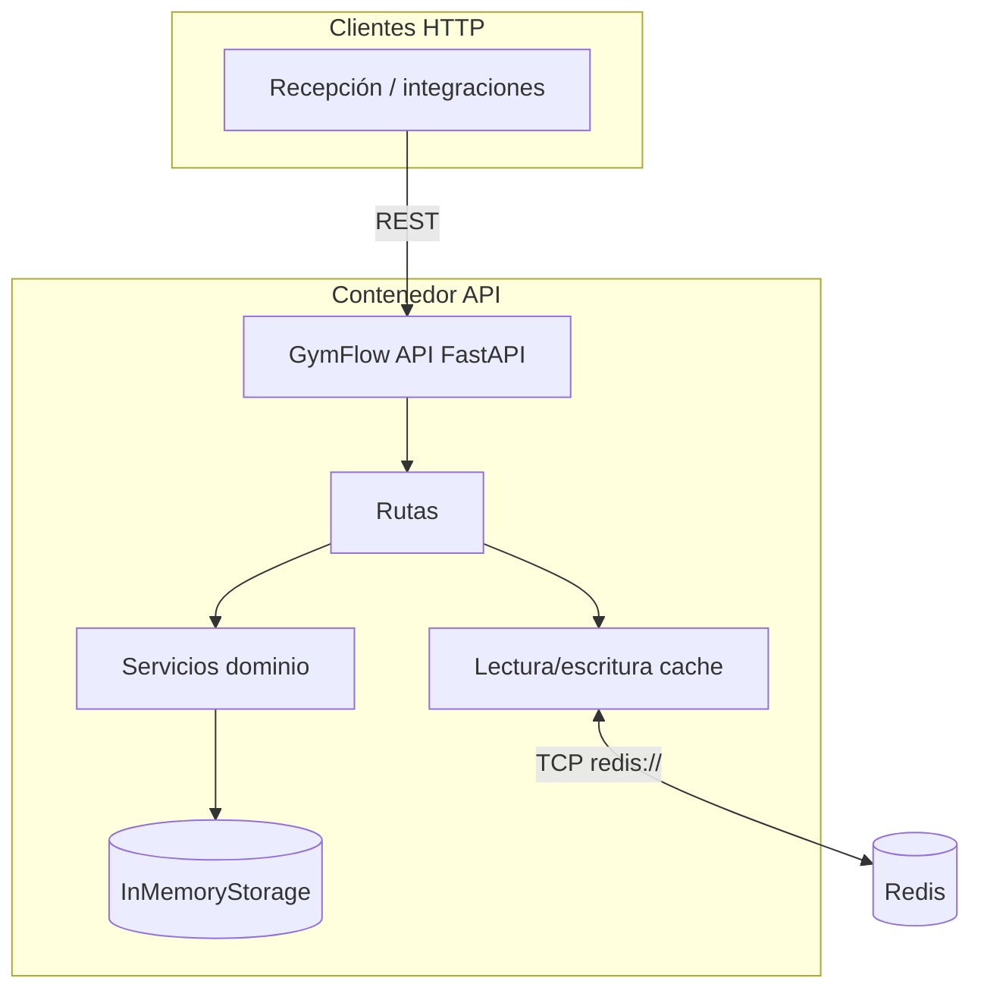
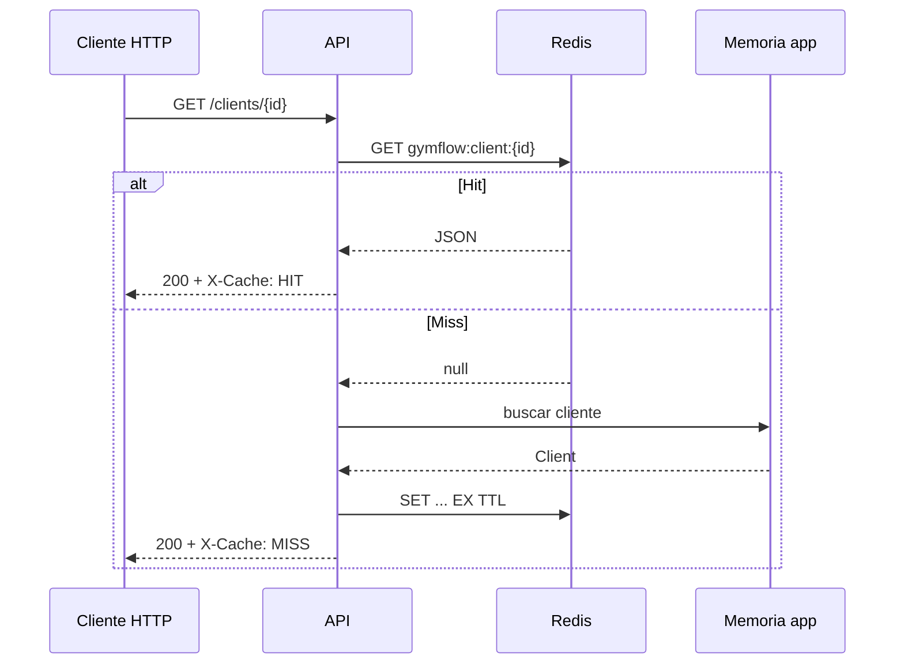

# GymFlow — Arquitectura (v2)

API **GymFlow** con **FastAPI**, **Pydantic**, almacenamiento en memoria y **Redis** como cache de lectura (cache-aside).

## Diagrama de componentes (Mermaid)



## Flujo con cache en `GET /clients/{id}`



## Dónde entra Redis

- Redis corre en un **contenedor Docker** definido en `docker-compose.yml`.
- La API resuelve la URL con la variable **`REDIS_URL`** (por ejemplo `redis://redis:6379/0` dentro de Compose).
- Solo las rutas que implementan cache-aside hablan con Redis; el resto del dominio sigue usando memoria local.

## Responsabilidad de Redis

| Rol | Descripción |
|-----|-------------|
| Cache de lectura | Almacenar copias serializadas de respuestas costosas o repetidas (por ahora: ficha de cliente). |
| TTL | Garantizar expiración automática de cada clave cacheada. |
| No es fuente de verdad | Los datos autoritarios del MVP siguen en `InMemoryStorage`; Redis es opcional en arranque (si falla la conexión, la API degrada a `BYPASS`). |

## Estructura de carpetas (relevante)

```
Tarea03/
  main.py                 # FastAPI + lifespan Redis
  Dockerfile
  docker-compose.yml
  requirements.txt
  app/
    core/
      config.py           # REDIS_URL, CACHE_TTL_CLIENT_SECONDS
    api/
      routes/
        clients.py        # GET con cache
    services/
      storage.py
      client_service.py
      client_cache.py     # claves y get/set con TTL
  docs/
    architecture.md
    cache.md
    requirements.md
    system-brief.md
```

## Contrato y documentación

- Swagger: `GET /docs`
- Salud y Redis: `GET /health` (`redis`: `up` | `down`)
- Detalle de cache: [cache.md](cache.md)
- Cómo ejecutar y probar: [run-and-test.md](run-and-test.md)

### Índice de documentos

| Archivo | Contenido |
|---------|-----------|
| [system-brief.md](system-brief.md) | Problema, alcance, contexto |
| [requirements.md](requirements.md) | Historias, backlog, Jira |
| [architecture.md](architecture.md) | Este documento |
| [cache.md](cache.md) | Redis, TTL, cache-aside |
| [run-and-test.md](run-and-test.md) | Docker, local, pruebas |

## Límites actuales

- Persistencia: la memoria de aplicación se pierde al reiniciar el contenedor de la API.
- Escalado horizontal: requeriría base de datos compartida y política de cache/invalidación acorde.
