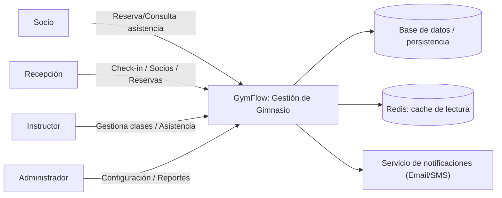

# System Brief v1 — Gestión de Gimnasio

## 1) Nombre del sistema
GymFlow — Gestión de socios, reservas y acceso

## 2) Problema que resuelve (resumen)
Socios y personal del gimnasio necesitan inscribirse, gestionar membresías, reservar clases o horarios y registrar asistencia de forma ordenada.
Actualmente el proceso suele ser manual (cuadernos, planillas, WhatsApp), lo que genera errores, doble reserva y poca visibilidad del uso real.
El sistema busca digitalizar la operación: altas de socios, planes y pagos, reserva de clases/cupos, control de acceso (check-in) y reportes básicos, con roles y trazabilidad.

## 3) Usuarios / Stakeholders
- Socio / miembro del gimnasio
- Recepción / Atención al cliente
- Instructor / Entrenador (clases y seguimiento)
- Administrador del gimnasio (configuración, planes, reportes, auditoría)

## 4) Objetivos de éxito (medibles si es posible)
- Reducir el tiempo de check-in a menos de 1 minuto por socio.
- Aumentar el porcentaje de clases con reserva previa y confirmación.
- Disminuir errores de cobro y duplicados mediante validaciones y un único registro por socio.
- Dar visibilidad de aforo y uso (asistencia por día/clase) para decisiones de horarios y capacidad.

## 5) Alcance (Scope) — incluye
- Registro y gestión de socios (datos básicos y contacto).
- Planes de membresía (tipos, vigencia, renovación).
- Reserva de clases o franjas horarias (crear, reprogramar, cancelar).
- Check-in de socios (registro de entrada/asistencia).
- Control de cupos por clase o franja.
- Roles y permisos (socio / recepción / instructor / admin).
- Reportes básicos (asistencia, ocupación, socios activos).
- Auditoría mínima (log de acciones sensibles).

## 6) No alcance (No-scope) — NO incluye
- Facturación electrónica e integración contable completa.
- Integración con pulseras/lectores biométricos (se deja para fase futura).
- Módulo de nutrición o planes de entrenamiento detallados.
- App móvil nativa; se prioriza uso web responsive.

## 7) Supuestos
- El gimnasio tiene horarios y tipos de clase definidos (o se configuran al inicio).
- Los socios tienen correo o teléfono válido para notificaciones y recordatorios.
- El pago de la membresía se gestiona fuera del sistema o de forma básica (registro de pago), sin pasarela de pago en v1.
- Se manejará al menos un idioma (español) inicialmente.

## 8) Riesgos y mitigaciones
- Riesgo: Acceso no autorizado o suplantación de socios.
  - Mitigación: Autenticación por usuario/contraseña, roles claros y registro de check-in con fecha/hora.
- Riesgo: Sobrecupo en clases o franjas.
  - Mitigación: Límite de cupos por clase, validación al reservar y al hacer check-in.
- Riesgo: Baja adopción por parte del personal.
  - Mitigación: Flujo simple de recepción (check-in rápido), capacitación breve y soporte en las primeras semanas.

## 9) Requerimientos v1
### Funcionales (FR)
- FR-01: El sistema debe permitir registrar y actualizar socios con datos básicos y contacto.
- FR-02: El sistema debe permitir definir planes de membresía (nombre, vigencia, precio) y asociarlos a socios.
- FR-03: El sistema debe permitir crear, reprogramar y cancelar reservas de clases o franjas horarias.
- FR-04: Recepción o el socio debe poder registrar check-in (entrada/asistencia) con validación de membresía vigente.
- FR-05: El sistema debe respetar cupos máximos por clase o franja y evitar sobrecupo.
- FR-06: El administrador debe poder configurar horarios, clases y cupos.
- FR-07: El socio debe poder consultar sus reservas, historial de asistencia y estado de su membresía.
- FR-08: El sistema debe permitir notificaciones (correo o SMS) para recordatorio de reserva y vencimiento de membresía.

### No funcionales (NFR) — medibles/verificables
- NFR-01 (Seguridad): Acceso al sistema requiere autenticación; acciones sensibles (altas, cambios de plan, check-in) deben quedar auditadas.
- NFR-02 (Rendimiento): Consulta de horarios y reserva deben responder en p95 < 500 ms bajo carga objetivo.
- NFR-03 (Disponibilidad): El sistema debe apuntar a 99 % disponibilidad en horario de operación del gimnasio.
- NFR-04 (Usabilidad): El flujo de check-in en recepción debe completarse en pocos pasos (< 3 clics o 1 escaneo).
- NFR-05 (Observabilidad): Requests críticas deben incluir correlation-id y logs para trazabilidad.

## 10) Diagrama de Contexto (Mermaid)

En el MVP actual de la API, la persistencia principal es **en memoria del proceso**; **Redis** actúa como **cache** (TTL) para consultas repetidas, por ejemplo la ficha de socio, y se despliega con **Docker Compose** junto a la API.
